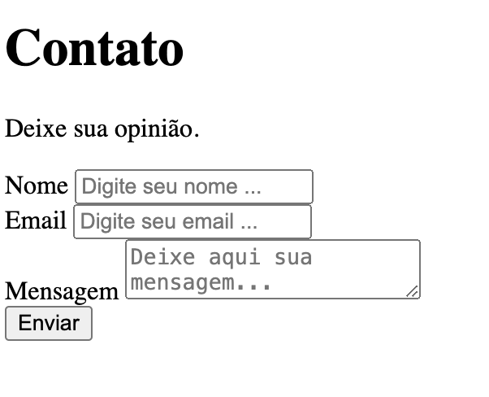
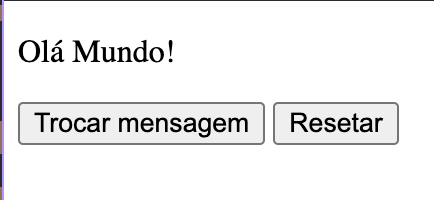
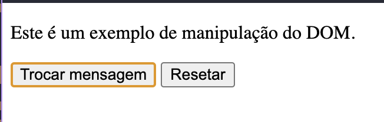
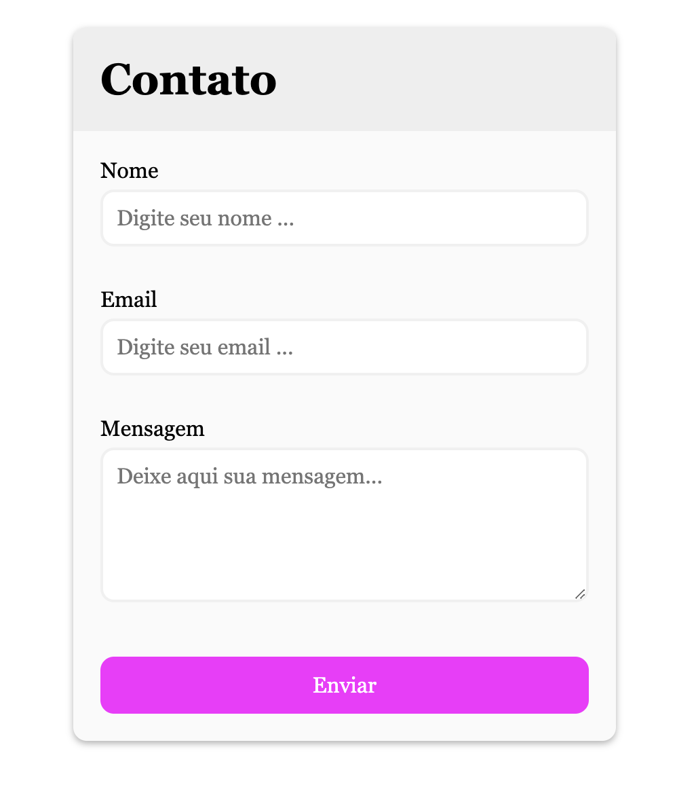
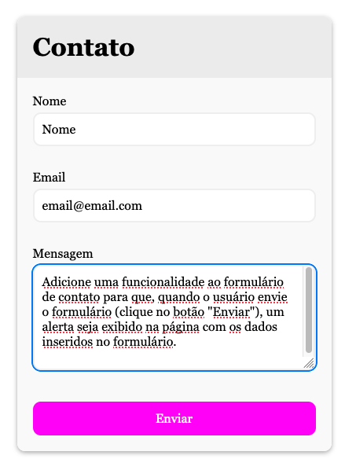
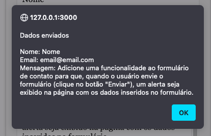
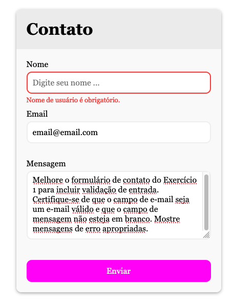
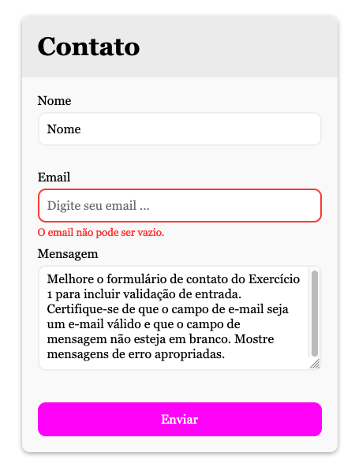
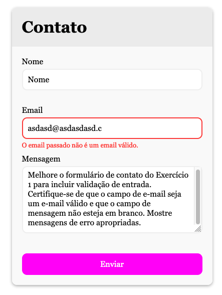
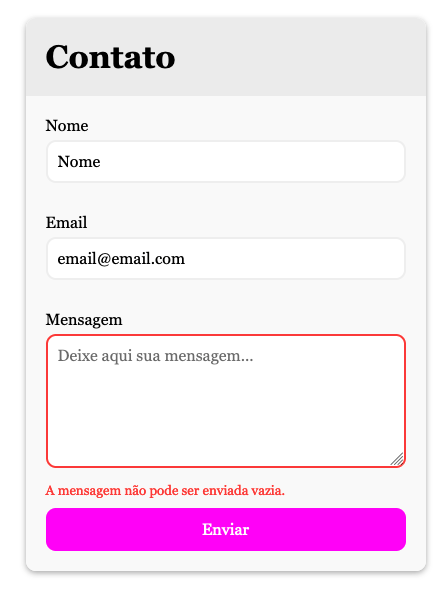

# Prova Técnica - Desenvolvedor Web

#### Exercícios

[Exercício 1](#exercício-1-formulário-de-contato)
[Exercício 2](#exercício-2-manipulação-do-dom)
[Exercício 3](#exercício-3-estilo-css)
[Exercício 4](#exercício-4-manipulação-de-eventos)
[Exercício 5](#exercício-5-validação-de-formulário)

#### Projetos

[Projeto 1](#projeto-1)
[Projeto 2](#projeto-2)
[Projeto 3](#projeto-3)
[Projeto 4](#projeto-4)
[Projeto 5](#projeto-5)

Instruções:

- Complete os exercícios abaixo, utilizando HTML, CSS e JavaScript, conforme necessário.
- Você pode usar qualquer editor de código de sua preferência.
- Lembre-se de que a clareza do código e as melhores práticas são importantes.
- Comente seu código, explicando o que você está fazendo.

### Exercícios

#### Exercício 1: Formulário de Contato

Crie um formulário de contato simples com os seguintes campos:

- Nome
- E-mail
- Mensagem
- Um botão "Enviar" que valide e envie o formulário.

#### Exercício 2: Manipulação do DOM

Crie um botão que, quando clicado, altera o texto de um parágrafo em uma página da web. O texto deve ser alternado entre "Olá, Mundo!" e "Este é um exemplo de manipulação do DOM."

#### Exercício 3: Estilo CSS

Crie um arquivo CSS externo que estilize o formulário de contato do Exercício 1. Certifique-se de que o formulário esteja esteticamente agradável e use pelo menos três propriedades de estilo diferentes.

#### Exercício 4: Manipulação de Eventos

Adicione uma funcionalidade ao formulário de contato para que, quando o usuário envie o formulário (clique no botão "Enviar"), um alerta seja exibido na página com os dados inseridos no formulário.

#### Exercício 5: Validação de Formulário

Melhore o formulário de contato do Exercício 1 para incluir validação de entrada. Certifique-se de que o campo de e-mail seja um e-mail válido e que o campo de mensagem não esteja em branco. Mostre mensagens de erro apropriadas.

## Projetos

#### Projeto 1

Foi criado um formúlario de Contato sem estilização

#### Projeto 2

Na página há um parágrafo com o texto "Olá Mundo!".
Quando se clica no botão "Trocar mensagem", o parágrafo troca o texto para "Este é uma exemplo de Manipulação de DOM.".
Temos também outro botão "Resetar" para voltar o texto original para o parágrafo.

#### Projeto 3

Foi aplicado estilos de CSS no mesmo formulário do [Exercício 1](#projeto-1) com melhor visualização.

#### Projeto 4

No formulário quando se clica no botão "Enviar", os dados dos inputs são mostrados em uma tela de alerta para o usuário.

#### Projeto 5

Foi incluído no formulário validações caso os dados estejam incorretos. As validações são a seguintes:

- O nome não pode ser vazio.

- O email não pode ser vazio.

- O email passado não está correto.

- A messagem não pode ser vazio.

